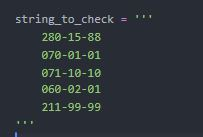
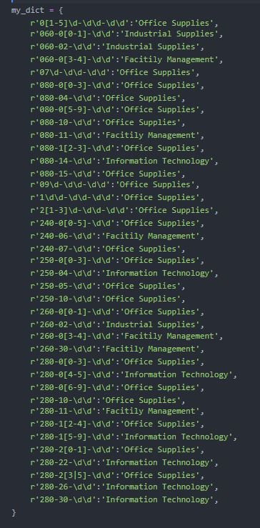
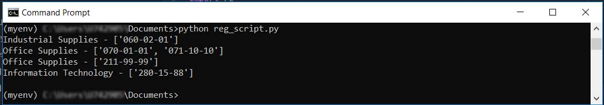

<h2>Regular Expression with Python</h2>
<h3>Intro</h3>

Due to wikipedia:

<i>Regular Expression [...] is a sequence of characters that define a search pattern. Usually such patterns are used by string-searching algorithms for "find" or "find and replace" operations on strings, or for input validation.</i>

<h3>Demo</h3>
<ul>
  <li>Having Sap Commodity Codes embraced within a string</li>
  
  <li>And dictionary with pairs: Regular Expression key - spend cluster</li>
  
  <li>I can decode the spend cluster for new coming in Sap Commodity Codes</li>
  
</ul>

